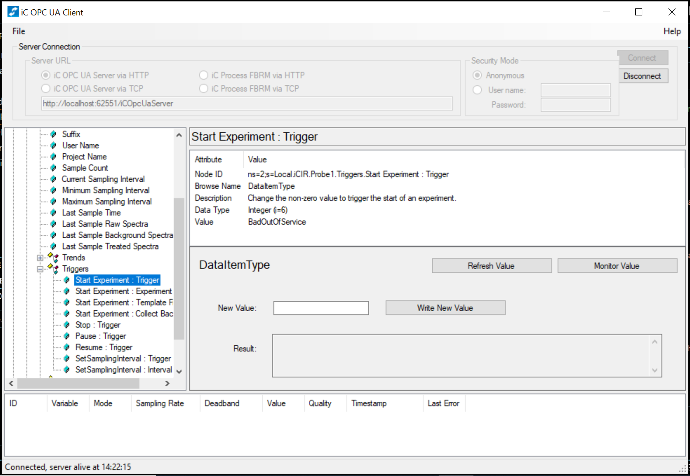

Shield: [![CC BY-NC-SA 4.0][cc-by-nc-sa-shield]][cc-by-nc-sa]

This work is licensed under a
[Creative Commons Attribution-NonCommercial-ShareAlike 4.0 International License][cc-by-nc-sa].

[![CC BY-NC-SA 4.0][cc-by-nc-sa-image]][cc-by-nc-sa]

[cc-by-nc-sa]: http://creativecommons.org/licenses/by-nc-sa/4.0/
[cc-by-nc-sa-image]: https://licensebuttons.net/l/by-nc-sa/4.0/88x31.png
[cc-by-nc-sa-shield]: https://img.shields.io/badge/License-CC%20BY--NC--SA%204.0-lightgrey.svg

# ReactPyR

ReactPyR was developed to allow Python control of Mettler's ReactIR system via their iCIR software. 
This project was developed and tested using Windows 10 and on a ReactIR15 system and is written in Python3.13.0 using asyncua (pypi.org/project/asyncua/).All testing of ReactPyR was conducted with iCIR version 7.1.91 SP1 and iC OPC UA Client version 1.2.22. 

All scripts created using Python 3.13.0. 

# Installation

Within the ReactPyR folder: 

    pip install -r requirements.txt

# Usage

For ReactPyR only: 
You should generate a script such as that shown in example_use.py

```Python
	python example_use.py
```

# ReactPyR
ReactPyR 2025 was developed by Mr Emanuele Berardi is licensed under Creative Commons Attribution-NonCommercial 4.0 International 

ReactPyR was developed to allow Python control of Mettler's ReactIR system via their iCIR software. 

This project was developed and tested using Windows 10 and on a ReactIR15 system and is written in Python3.13.0 using asyncua (pypi.org/project/asyncua/).All testing of ReactPyR was conducted with iCIR version 7.1.91 SP1 and iC OPC UA Client version 1.2.22. 

Node IDs were obtained using iC OPC UA. 



## Example Use
```Python
import asyncio
    from ReactPyR import ReactPyR

    # Example with all the above functionality.

    async def main():
        """The main event loop demonstrating basic function calls."""

        # Making the object.
        tcp_path = 'opc.tcp://localhost:62552/iCOpcUaServer'
        ir_machine = ReactPyR(opc_server_path=tcp_path)

        # Starting an experiment.
        template_name = 'SensingSensitivityTemplate'
        spectra_path = 'DSensing Sensitivity Project\\test1'
        await ir_machine.start_experiment(spectra_path, template_name, False)

        # Retrieving the intensities of previous background spectra.
        background = await ir_machine.get_last_background_spectra()

        # Collecting all the raw and processed IR spectra.
        await ir_machine.collect_raw_spectra()
        await asyncio.sleep(120)

        await ir_machine.collect_treated_spectra()

        # Changing sampling interval to 20 seconds.
        new_sampling_interval = 20
        await ir_machine.set_sampling_interval(new_sampling_interval)
        current_sampling_interval = await ir_machine.get_current_sampling_interval()
        if new_sampling_interval == current_sampling_interval:
            print('Sampling interval changed successfully.')

        # Pausing experiment for 20 seconds then resuming for another 20.
        await ir_machine.pause_experiment()
        await asyncio.sleep(20)
        await ir_machine.resume_experiment()
        await asyncio.sleep(20)

        # Stopping experiment
        await ir_machine.stop_experiment()

    asyncio.run(main())
```

# Data Analysis

A data analysis package for ReactIR Data created using this method can be found here: https://github.com/Bell-Group-Glasgow/SensingSensitivity/